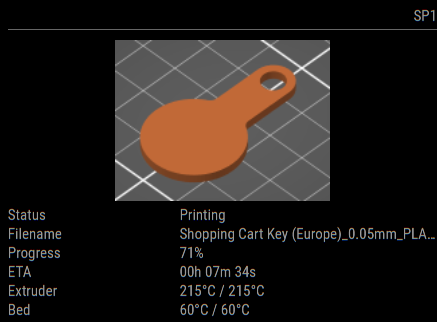

# MMM-octoprint

This is a module for the [MagicMirror²](https://github.com/MichMich/MagicMirror/).



This module will use the Octoprint API to show your current print status on your MagicMirror²!

## Installation

In your terminal, go to your MagicMirror's Module folder:

```bash
cd ~/MagicMirror/modules
```

Clone this repository:

```bash
git clone https://github.com/btastic/MMM-octoprint
```

## Using the module

To use this module, add the following configuration block to the modules array in the `config/config.js` file:
```js
var config = {
    modules: [
        {
            module: 'MMM-octoprint',
            position: 'top_right',
            config: {
                endpoint: "",
                apiKey: "",
                updateInterval: 60000,
                showThumbnail: false,
                showLayerProgress: false,
                thumbnailSize: 150,
                hideDataOnStandby: true
            }
        }
    ]
}
```

## Layer progress
To display the layer progress you have to install the [DisplayLayerProgress](https://plugins.octoprint.org/plugins/DisplayLayerProgress/) plugin. Please follow the [instructions](https://github.com/OllisGit/OctoPrint-DisplayLayerProgress/wiki/How-does-the-plugin-works) to set up your slicer accordingly or use the automatic detection of `;LAYER:<num>` during gcode upload.

## Thumbnails
To display a thumbnail you have to install the [Slicer Thumbnails](https://plugins.octoprint.org/plugins/prusaslicerthumbnails/) plugin.

## Customization
To change the color of the progress bar, you can override the default colors (green on gray) with css in your custom.css file.

For example:
```css
.MMM-octoprint {
  --progress-color: crimson;
  --progress-background-color: gray;
}
```

## Configuration options

| Option               | Description
|--------------------- |-----------
| `endpoint`           | *Required* <br>Endpoint of the Octoprint API. For example: http://192.168.0.75<br><br>**Type:** `string`(url) 
| `apiKey`           | *Required* <br>API Key for Authorization. To create an application key, follow the instructions on [Octoprint docs](https://docs.octoprint.org/en/master/bundledplugins/appkeys.html)<br><br>**Type:** `string` 
| `updateInterval`     | *Optional* <br>The time interval between UI updates.<br><br>**Type:** `int`(milliseconds)<br>**Default:** 60000 milliseconds (60 seconds)
| `showThumbnail`      | *Optional* <br>Shows a thumbnail embedded in your gcode files. <br><br>**Only enable this, once you configured the thumbnails plugin and your slicer.**<br><br>**Type:** `bool` <br>**Default:** false
| `showLayerProgress`  | *Optional* <br>Shows the layer progress. <br><br> **Only enable this, once you configured the layer progress plugin and your slicer.**<br><br>**Type:** `bool` <br>**Default:** false
| `thumbnailSize`      | *Optional* <br>Changes with thumbnails size (width). Enter a integer value for an absolute value, or a relative size with % (e.g. "50%").<br><br>**Type:** `int\|string` <br>**Default:** 150
| `hideDataOnStandby`  | *Optional* <br>Hides printer info when the printer is operational.<br><br>**Type:** `bool` <br>**Default:** true

## Available localizations
- English (en)
- German (de)